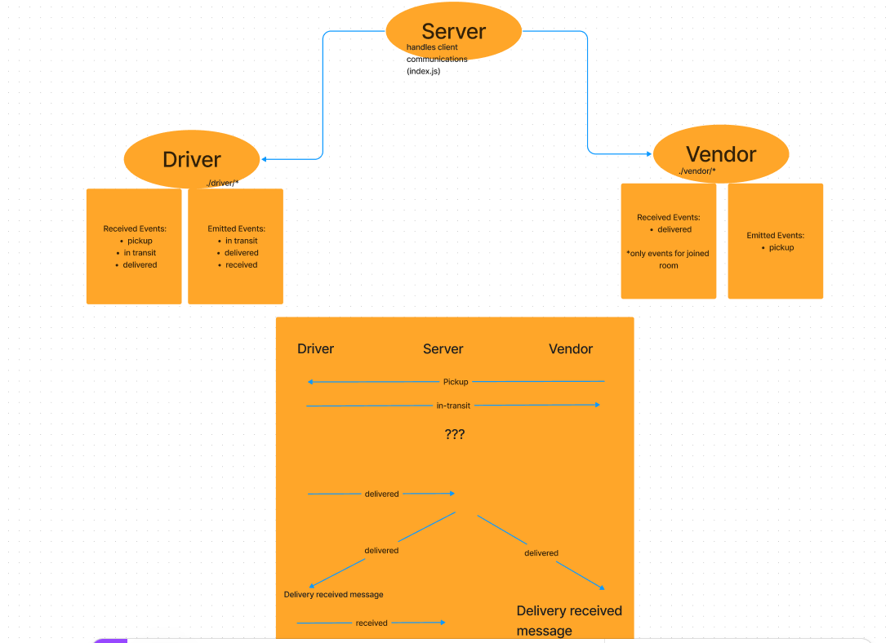
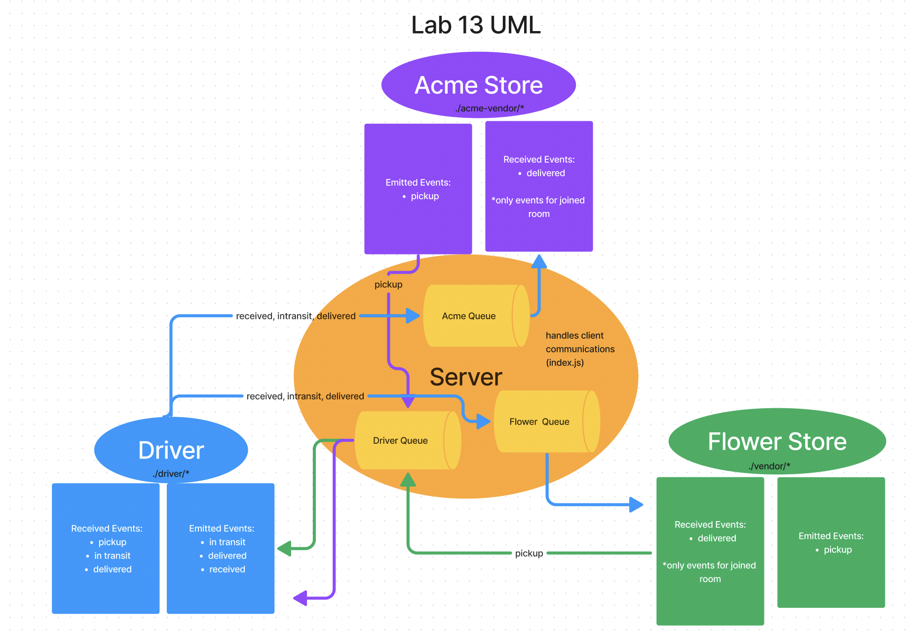

# LAB - Class 11, 12, 13: Event Driven Applications

### Author: Eva Grace Smith

### Problem Domain

This is the start of a 4 build phase for a CAPs system built in Node.js.  Initial goal is to set up a pool of events and handlers that communicate with each other based on a package in its different steps along its way to being delivered.

Major functionality to cover in lab:

    As a vendor, I want to alert the system when I have a package to be picked up.
    As a driver, I want to be notified when there is a package to be delivered.
    As a driver, I want to alert the system when I have picked up a package and it is in transit.
    As a driver, I want to alert the system when a package has been delivered.
    As a vendor, I want to be notified when my package has been delivered.

### Links and Resources

- [GitHub Actions ci/cd](https://github.com/EvaGraceSmith/caps/actions)
<!-- - [back-end server url](http://xyz.com) (when applicable) -->

### Collaborators

* [Hayden Cooper](https://github.com/Hcooper23)
* [Katherine Lee](https://github.com/KatiLee)
* [Reece Renninger](https://github.com/ReeceRenninger)
* [Dustin Yelland](https://github.com/dustinyschild)
* [Mark R Smith](https://github.com/markmrsmith)

### Setup

#### `.env` requirements (where applicable)

for now I have none and do not require one

#### How to initialize/run your application (where applicable)

 `nodemon`

#### How to use your library (where applicable)

#### Features / Routes

#### Tests

- Tests have been built out to ensure the handlers are emitting the correct messages.
- These can be ran using npm test (filename).
- Tests created utilizing [chatGPT](https://chat.openai.com/share/1e99d194-5b59-413a-a7ed-cf8e67caffd3) per class guidelines.

## UML - Lab 12

#### UML- Lab 13

